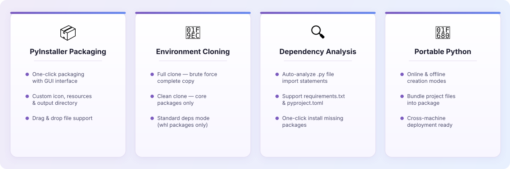

# Python Manager

A GUI toolkit for Python environment management — PyInstaller packaging, environment cloning, dependency analysis, and portable Python bundling.

[English](README.md) | [中文](README_CN.md) | [Changelog](CHANGELOG.md)

<p align="center">
  
</p>

---

## Features

<p align="center">
  
</p>

### PyInstaller Packaging
- **One-click GUI packaging** - Select a `.py` file and pack it into an executable
- **Custom options** - Icon, resource folder, output directory, single-file mode
- **Drag & drop** - Drop files directly into the window

### Environment Cloning
- **Brute-force clone** - Full copy of the Python environment for cross-machine deployment
- **Clean clone** - Core Python only, minimal footprint
- **Standard deps mode** - Download `.whl` packages only

### Dependency Analysis
- **Auto-analyze** - Parse `.py` file imports and detect missing packages
- **Multi-format** - Support `requirements.txt` and `pyproject.toml`
- **One-click install** - Install all missing dependencies at once

### Portable Python Bundling
- **Online / Offline modes** - Download from network or clone local environment
- **Bundle project files** - Include your source code in the package
- **Ready to run** - Deploy on any machine without installing Python

---

## System Requirements

| Platform | Minimum Version |
|----------|-----------------|
| Windows  | Windows 10+     |
| macOS    | macOS 10.15+    |

---

## Installation

### From Releases

Download the latest version from [Releases](https://github.com/Tonyhzk/python-manager/releases).

### From Source

```bash
git clone https://github.com/Tonyhzk/python-manager.git
cd python-manager/src
pip install ttkbootstrap
python3 run.py
```

---

## Quick Start

1. Run the application:
   ```bash
   # Windows
   src\run.bat

   # macOS / Linux
   bash src/run.sh
   ```

2. Select a tab for the desired function (Packaging / Cloning / Dependencies / Portable)

3. Configure options and click the action button

---

## Tech Stack

| Category | Technology |
|----------|-----------|
| Language | Python |
| GUI Framework | ttkbootstrap (Tkinter) |
| Packaging | PyInstaller |
| Drag & Drop | tkinterdnd2 (optional) |

---

## Project Structure

```
python-manager/
├── src/
│   ├── run.py              # Entry point
│   ├── run.bat             # Windows launcher
│   ├── run.sh              # macOS/Linux launcher
│   └── python_manager/     # Main package
│       ├── l0_resource/    # Constants, i18n, logger
│       ├── l1_entry/       # Application entry
│       ├── l2_gui/         # GUI components
│       ├── l3_coordinator/ # Business logic coordinator
│       ├── l4_molecule/    # Feature modules
│       └── l5_atom/        # Utility functions
├── VERSION
├── LICENSE
└── README.md
```

---

## License

[Apache License 2.0](LICENSE)

## Author

**Tonyhzk**

- GitHub: [@Tonyhzk](https://github.com/Tonyhzk)
- Project: [python-manager](https://github.com/Tonyhzk/python-manager)

<div align="center">

If this project helps you, give it a ⭐ Star!

</div>
