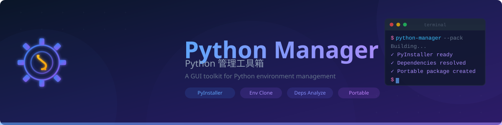
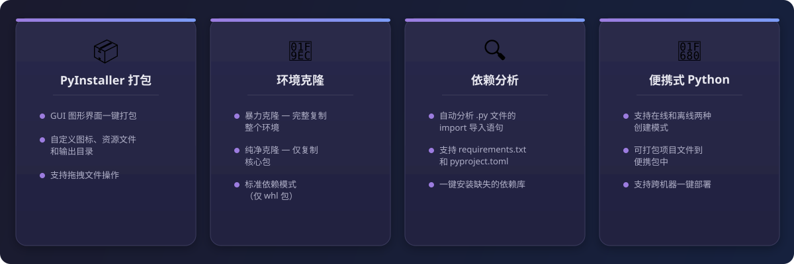

# Python 管理工具箱

Python 环境管理 GUI 工具集 — PyInstaller 打包、环境克隆、依赖分析、便携式 Python 打包。

**中文** | [English](README.md) | [更新日志](CHANGELOG_CN.md)

<p align="center">
  
</p>

---

## 功能特性

<p align="center">
  
</p>

### PyInstaller 打包
- **GUI 一键打包** - 选择 `.py` 文件，一键生成可执行文件
- **自定义选项** - 图标、资源文件夹、输出目录、单文件模式
- **拖拽支持** - 直接拖放文件到窗口

### 环境克隆
- **暴力克隆** - 完整复制 Python 环境，跨机器免安装部署
- **纯净克隆** - 仅复制 Python 核心，体积最小
- **标准依赖模式** - 仅下载 `.whl` 安装包

### 依赖分析
- **自动分析** - 解析 `.py` 文件的 import 语句，检测缺失库
- **多格式支持** - 支持 `requirements.txt` 和 `pyproject.toml`
- **一键安装** - 批量安装所有缺失依赖

### 便携式 Python 打包
- **在线/离线模式** - 从网络下载或克隆本地环境
- **打包项目文件** - 将源代码一并打包
- **开箱即用** - 在任意机器上无需安装 Python 即可运行

---

## 系统要求

| 平台 | 最低版本 |
|------|---------|
| Windows | Windows 10+ |
| macOS | macOS 10.15+ |

---

## 安装

### 从 Releases 下载

从 [Releases](https://github.com/Tonyhzk/python-manager/releases) 页面下载最新版本。

### 从源码运行

```bash
git clone https://github.com/Tonyhzk/python-manager.git
cd python-manager/src
pip install ttkbootstrap
python3 run.py
```

---

## 快速开始

1. 启动应用：
   ```bash
   # Windows
   src\run.bat

   # macOS / Linux
   bash src/run.sh
   ```

2. 选择对应功能标签页（打包 / 克隆 / 依赖 / 便携式）

3. 配置选项后点击执行按钮

---

## 技术栈

| 类别 | 技术 |
|-----|------|
| 开发语言 | Python |
| GUI 框架 | ttkbootstrap (Tkinter) |
| 打包工具 | PyInstaller |
| 拖拽支持 | tkinterdnd2（可选） |

---

## 项目结构

```
python-manager/
├── src/
│   ├── run.py              # 启动入口
│   ├── run.bat             # Windows 启动脚本
│   ├── run.sh              # macOS/Linux 启动脚本
│   └── python_manager/     # 主程序包
│       ├── l0_resource/    # 常量、国际化、日志
│       ├── l1_entry/       # 程序入口
│       ├── l2_gui/         # GUI 组件
│       ├── l3_coordinator/ # 业务逻辑协调器
│       ├── l4_molecule/    # 功能模块
│       └── l5_atom/        # 工具函数
├── VERSION
├── LICENSE
└── README.md
```

---

## 许可证

[Apache License 2.0](LICENSE)

## 作者

**Tonyhzk**

- GitHub: [@Tonyhzk](https://github.com/Tonyhzk)
- 项目地址: [python-manager](https://github.com/Tonyhzk/python-manager)

<div align="center">

如果这个项目对你有帮助，欢迎给个 ⭐ Star！

</div>
